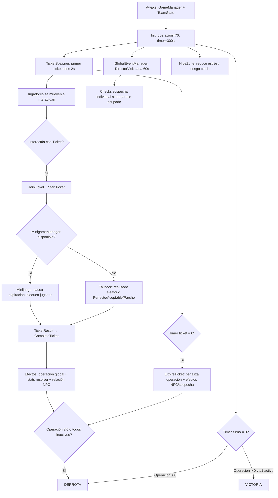

# Reporte técnico — IT Hospital Simulator (Prototipo local co-op)

**Fecha del reporte:** 9 de julio de 2026  
**Escena principal:** `Assets/Scenes/Prototype_01_LocalCoop.unity`  
**Alcance:** inspección del código y escena actuales. Sin cambios realizados.

---

## 1. Rama actual de Git

| Campo | Valor |
|---|---|
| **Rama** | `jonathan/local-coop-prototype` |
| **Estado remoto** | Sincronizada con `origin/jonathan/local-coop-prototype` |
| **Cambios sin commitear** | **Ninguno** — working tree clean |

### Últimos 5 commits

| Hash | Mensaje | Fecha |
|---|---|---|
| `a5fa606` | Add ticket queue and priority system | 2026-07-09 19:08 |
| `335481b` | Add ticket queue and priority system | 2026-07-09 18:36 |
| `a9832d6` | Add director visit event | 2026-07-09 17:59 |
| `d7642f6` | Add router minigame prototype | 2026-07-09 17:51 |
| `4472d10` | Add cable minigame prototype | 2026-07-09 17:33 |

> **Nota:** El commit más reciente (`a5fa606`) incluye más que la cola de tickets: refactor de métricas globales/individuales (`TeamState`, `PlayerStats`), sistema NPC y actualización de escena.

---

## 2. Estado general del prototipo

Resumen de qué **ya funciona** al dar Play en `Prototype_01_LocalCoop`:

| Sistema | Estado |
|---|---|
| **Jugadores locales (2)** | ✅ Funcional — J1 (WASD + E), J2 (flechas + Ctrl/Enter) |
| **Movimiento** | ✅ Cápsulas kinematic, velocidad 30, cámara perspectiva fija |
| **Tickets** | ✅ Spawn, interacción, timer, expiración, destrucción al resolver |
| **Cola de tickets** | ✅ UI ordenada por prioridad y tiempo restante |
| **Microjuegos** | ✅ Cable y Router; un solo minijuego activo a la vez |
| **Métricas globales** | ✅ Operación + timer de turno (300 s) |
| **Métricas por jugador** | ✅ Estrés, sospecha, desempeño, actas, activo/inactivo |
| **NPC / requester** | ✅ Asignación por zona/título; relaciones por jugador en UI |
| **Relaciones** | ✅ Suben/bajan al resolver o expirar tickets |
| **Eventos globales** | ✅ Visita del director (cada 60 s, dura 15 s) |
| **Hide zone** | ✅ Reduce estrés; riesgo de ser “cachado” |
| **Victoria / derrota** | ✅ Global e individual implementadas |

**No implementado / placeholder:**

- NPCs visibles en el mundo (solo datos + UI)
- Modo co-op real Duo/Team en tickets (infraestructura existe, todos los tickets son Solo)
- Networking, persistencia, ScriptableObjects
- Arte final, animaciones, feedback visual de eliminación individual

---

## 3. Arquitectura actual

### Core

| Script | Responsabilidad |
|---|---|
| `GameManager.cs` | Singleton orquestador: tick de tiempo, victoria/derrota global, mensajes temporales, refresh UI |
| `TeamState.cs` | Estado del equipo: operación (0–100), timer, `GameState` (Playing/Won/Lost) |
| `IInteractable.cs` | Contrato de interacción (`Interact(PlayerController)`) |
| `GameState` (enum) | Playing, Won, Lost |

### Players

| Script | Responsabilidad |
|---|---|
| `PlayerController.cs` | Input (Input System), movimiento, detección de interactables, bloqueo en minijuego, lógica “parece ocupado” |
| `PlayerStats.cs` | Métricas individuales y eliminación (burnout, promoción, actas/despido) |

### Tickets

| Script | Responsabilidad |
|---|---|
| `Ticket.cs` | Entidad interactuable: timer, prioridad, NPC requester, resolución/expiración, efectos en métricas |
| `TicketSpawner.cs` | Spawn periódico en puntos de zona (8–14 s, máx. 5 activos, límite 30 s) |
| `TicketEnums.cs` | `TicketType`, `TicketResult`, `TicketMode` |
| `TicketPriority.cs` | Low / Medium / High / Critical |
| `TicketData.cs` | `TicketSpawnData` + `TicketDefinitionLibrary` (8 definiciones hardcodeadas) |

### Minigames

| Script | Responsabilidad |
|---|---|
| `MinigameBase.cs` | Clase abstracta: ciclo start → complete/cancel → callback a `MinigameManager` |
| `MinigameManager.cs` | Singleton: enruta ticket → minijuego, pausa expiración, bloquea jugador |
| `CableMinigame.cs` | Elegir cable correcto (1/2/3 o A/B/C) en ≤6 s |
| `RouterMinigame.cs` | Mantener y soltar botón en ventana de tiempo (2.0–3.5 s ideal) |

### NPCs

| Script | Responsabilidad |
|---|---|
| `NPCManager.cs` | 5 NPCs default, asignación por zona, relaciones `Dictionary<playerId, Dictionary<npcId, score>>` |
| `NPCData.cs` | id, nombre, departamento, personalidad |
| `NPCPersonality.cs` | Friendly, Neutral, Snitch, Important |

### Events

| Script | Responsabilidad |
|---|---|
| `GlobalEventManager.cs` | Evento “Visita del director”: banner, checks de sospecha cada 3 s |
| `GlobalEventType.cs` | Solo `DirectorVisit` por ahora |

### Zones

| Script | Responsabilidad |
|---|---|
| `HideZone.cs` | Trigger en Cuarto Servidores: baja estrés, chance de ser cachado (+25 sospecha) |

### UI

| Script | Responsabilidad |
|---|---|
| `UIManager.cs` | Operación, timer, paneles J1/J2, cola, relaciones, banner evento, mensajes, pantalla final |
| `WorldBillboardLabel.cs` | Labels 3D que miran a la cámara (zonas, J1/J2) |

### Editor (setup de escena, no runtime)

| Script | Menú |
|---|---|
| `PrototypeSceneBuilder.cs` | `IT Hospital → Build Prototype 01 Scene` |
| `MinigameSetup.cs` | Setup Minigames / Cable UI |
| `EventSetup.cs` | Setup Global Events |
| `WorldLabelsSetup.cs` | Add World Labels |
| `TicketQueueSetup.cs` | Setup Ticket Queue UI |
| `NPCSetup.cs` | Setup NPC System |
| `MetricsUISetup.cs` | Setup Individual Metrics UI |

---

## 4. Flujo actual de gameplay (loop al dar Play)



### Paso a paso

1. **Inicio:** `GameManager` inicializa `TeamState` (operación 70, turno 300 s). UI se refresca.
2. **Spawn de tickets:** Tras 2 s, `TicketSpawner` instancia tickets cada 8–14 s (máx. 5). Elige definición según zona del spawn point y asigna NPC requester.
3. **Tomar ticket:** Jugador entra en radio de interacción (2 u) y pulsa interactuar. Se registra como participante (`lastTouchedPlayer`).
4. **Abrir minijuego:** Si hay `requiredPlayers` cumplidos (siempre 1 hoy), `MinigameManager` abre Cable o Router según `TicketType`. El timer del ticket se pausa; el jugador no se mueve.
5. **Resultado:** El minijuego llama `FinishMinigame(TicketResult)` → `Ticket.CompleteTicket()`.
6. **Efectos:** Operación global sube/baja; el resolver recibe estrés/desempeño/sospecha; relación con NPC requester cambia según resultado y personalidad.
7. **Expiración:** Si nadie resuelve a tiempo (30 s), penaliza operación por prioridad, baja relación NPC, y +10 sospecha al jugador que lo tocó (si hubo).
8. **Eventos paralelos:** Visita del director penaliza sospecha individual. Hide zone baja estrés pero es riesgosa durante visita.
9. **Fin de partida:** Victoria si timer = 0 con operación > 0 y al menos un jugador activo. Derrota si operación ≤ 0 o todos inactivos. Eliminaciones individuales pueden ocurrir en cualquier momento.

---

## 5. Métricas actuales

### Globales (`TeamState` / `GameManager`)

| Métrica | Rango | Inicio | Efecto |
|---|---|---|---|
| **Operación** | 0–100 | 70 | Sube al resolver tickets; baja al expirar o fallar. ≤0 = derrota global |
| **Timer de turno** | cuenta regresiva | 300 s | =0 dispara evaluación victoria/derrota |
| **Estado del juego** | Playing / Won / Lost | Playing | — |

### Por jugador (`PlayerStats`)

| Métrica | Rango | Inicio (escena) | Umbral / efecto |
|---|---|---|---|
| **Estrés** | 0–100 | 20 | ≥100 → burnout → inactivo |
| **Sospecha** | 0–100 | 0 | ≥100 → acta (+1), reset a 40; 3 actas → despido |
| **Desempeño visible** | 0–100 | 30 | ≥100 → promoción → inactivo |
| **Actas** | entero | 0 | 3 → despido |
| **Estado activo** | bool | true | false bloquea movimiento e interacción |

**Fuentes de cambio por jugador:**

- Resolver ticket (estrés/desempeño/sospecha según `TicketResult`)
- Expirar ticket que tocó (+10 sospecha)
- Hide zone (−3 estrés/s; catch aleatorio +25 sospecha)
- Visita del director (+15 sospecha si no parece ocupado; +25 si está en hide zone)
- NPC Snitch al expirar (+10 sospecha a todos los activos)
- NPC Important al expirar (−5 desempeño al que tocó el ticket)

### Relaciones con NPCs (por jugador, no global)

- Rango: **−100 a +100**, inicio en **0** para cada par jugador–NPC
- Solo visibles en UI; no afectan gameplay directo salvo efectos al resolver/expirar

---

## 6. Sistema de tickets

### Datos de un ticket

| Campo | Descripción |
|---|---|
| `ticketTitle` | Título descriptivo (ej. “Urgencias perdió conexión”) |
| `zoneName` | Recepción, Urgencias, Cuarto Servidores |
| `priority` | Low / Medium / High / Critical |
| `isCritical` | Flag extra; escala visual y mensaje al spawn |
| `ticketType` | Cable o Router → determina minijuego |
| `ticketMode` | Solo / Duo / Team (todos los definidos hoy son Solo) |
| `requiredPlayers` | Jugadores necesarios para iniciar (siempre 1 hoy) |
| `requesterNpc` | Referencia a `NPCData` |
| `timeLeft` | 30 s por defecto (configurable en spawner) |
| Color/escala | Por prioridad; críticos más rojos y ligeramente más grandes |

### Generación

1. `TicketSpawner` elige spawn point aleatorio (Recepción, Urgencias o Cuarto Servidores).
2. `TicketDefinitionLibrary.GetRandomForZone()` elige entre 8 definiciones hardcodeadas filtradas por zona.
3. Se instancia prefab `Assets/Prefabs/Ticket.prefab`.
4. Se asigna NPC con `NPCManager.GetNpcForZone()` (regla especial: títulos con “Dirección” → Mendoza).

### Prioridad

- Visual: amarillo (Low) → naranja (High) → rojo (Critical).
- Cola UI: Critical > High > Medium > Low; empate por menos tiempo restante.
- Expiración penaliza operación: Low −5, Medium −10, High −18, Critical −25.

### Si expira

- Penalización global de operación (por prioridad).
- Relación −10 con requester; efectos extra por personalidad (ver sección 8).
- +10 sospecha al `lastTouchedPlayer` si existe.
- **TODO en código:** si expira sin jugador que lo tocó, no hay penalización de relación definida.

### Si se resuelve

- Efectos en operación y stats del resolver (primer participante en la lista).
- Cambio de relación con requester según `TicketResult`.
- Mensaje temporal en pantalla; ticket destruido.

### Conexión con microjuegos

- `TicketType.Cable` → `CableMinigame`
- `TicketType.Router` → `RouterMinigame`
- Si no hay minijuego configurado → `RollRandomResult()` (Perfecto/Aceptable/ParcheRapido, sin Fallo)

---

## 7. Microjuegos implementados

### CableMinigame — “Seguir cable”

- **Duración:** 6 s máximo.
- **Mecánica:** elegir 1 de 3 cables (teclas 1/2/3, A/B/C, o botones UI).
- **Resultados:**
  - Cable correcto en <2.5 s → `Perfecto`
  - Cable correcto más lento → `Aceptable`
  - Cable incorrecto → `ParcheRapido`
  - Timeout → `Fallo`

### RouterMinigame — “Reiniciar router”

- **Duración:** 6 s máximo para completar el intento.
- **Mecánica:** mantener Space o botón UI; soltar en ventana de tiempo.
- **Resultados:**
  - 2.6–3.2 s → `Perfecto`
  - 2.0–3.5 s (fuera de perfecto) → `Aceptable`
  - >3.5 s → `ParcheRapido`
  - <2.0 s o timeout sin soltar bien → `Fallo`

### Devolución de `TicketResult`

Ambos heredan `MinigameBase` y llaman:

```csharp
CompleteMinigame(result);           // Cable
CompleteMinigame(result, message);  // Router (mensaje custom)
```

→ `MinigameManager.FinishMinigame()` → `Ticket.CompleteTicket(result, customMessage)`.

---

## 8. Sistema NPC / relaciones

### NPCs existentes (hardcodeados en `NPCManager`)

| ID | Nombre | Departamento | Personalidad |
|---|---|---|---|
| `paty` | Paty | Recepción | Friendly |
| `dr_ramirez` | Dr. Ramírez | Urgencias | Important |
| `mendoza` | Mendoza | Dirección | Snitch |
| `carlos` | Carlos | Almacén | Friendly |
| `mariana` | Mariana | RH | Neutral |

### Asignación a tickets

- Match por zona (ej. Recepción → Paty o Mendoza; Urgencias → Dr. Ramírez o Mariana).
- Título con “Dirección” fuerza Mendoza.
- Fallback: NPC aleatorio.
- Debug en spawner: `useDebugNpc` + `debugNpcId`.

### Relaciones: por jugador, no globales

- Cada jugador tiene scores independientes con cada NPC (−100…+100).
- UI muestra “Relaciones J1” y “Relaciones J2”.

### Cómo suben/bajan

**Al resolver (por jugador que resolvió):**

| Resultado | Relación |
|---|---|
| Perfecto | +15 (+5 desempeño extra si Important) |
| Aceptable | +10 |
| ParcheRapido | +5 |
| Fallo | −10 |

**Al expirar (solo si hubo jugador que tocó el ticket):**

| Personalidad | Efecto extra |
|---|---|
| **Friendly** | −5 relación adicional; mensaje “se decepcionó” |
| **Neutral** | −10 relación; mensaje genérico |
| **Snitch** | −15 relación; +10 sospecha a **todos** los jugadores activos |
| **Important** | −15 relación; −5 operación global; −5 desempeño al jugador que tocó |

> Las relaciones altas/bajas **no tienen efectos de gameplay continuos** hoy (solo cambian en eventos de ticket).

---

## 9. Eventos globales

### DirectorVisit (único evento implementado)

| Parámetro | Valor default |
|---|---|
| Intervalo entre eventos | 60 s |
| Duración | 15 s |
| Check de sospecha | cada 3 s |

### Cómo determina si un jugador “parece ocupado” (`PlayerController.AppearsOccupied()`)

Considera **ocupado** si:

- Está inactivo (eliminado) — no penaliza
- Tiene minijuego activo
- Está cerca de un ticket
- Tiene input de movimiento o se movió recientemente (<0.15 s)
- Lleva menos de 3 s idle

Considera **NO ocupado** si:

- Está idle ≥3 s sin estar en ticket/minijuego
- Está en hide zone (siempre sospechoso durante visita)

### Penalizaciones

| Situación | Penalización |
|---|---|
| No parece ocupado | +15 sospecha individual |
| En hide zone durante visita | +25 sospecha individual |

Banner UI: `EVENTO: VISITA DEL DIRECTOR`. Mensajes temporales por jugador penalizado.

---

## 10. UI actual

### Barras / stats globales

- **Operación:** `Operación: {0–100}`
- **Timer:** `Tiempo: {segundos}s`

### Stats por jugador (paneles J1 y J2)

```
J1 [ACTIVO / INACTIVO (motivo)]
Estrés: X  Sospecha: Y
Desempeño: Z  Actas: N
```

### Cola de tickets

- Título: `COLA DE TICKETS`
- Líneas: `[CRIT|LOW|MED|HIGH] {NPC}: {título} — {zona} — {seg}s`
- Orden: prioridad desc, tiempo asc

### Relaciones

- Bloque con scores de los 5 NPCs para J1 y J2

### Mensajes temporales

- Centro/inferior (~3 s): spawns críticos, resoluciones, expiraciones, eventos, eliminaciones

### Banner de evento global

- Texto fijo durante Visita del Director

### Pantalla final

- Panel con **VICTORIA** o **DERROTA** + razón (`Turno sobrevivido`, `Colapso hospitalario`, etc.)

### Mundo 3D

- Labels billboard en zonas y sobre jugadores (J1/J2)

---

## 11. Limitaciones / deuda técnica

### Hardcodeado

- 8 definiciones de tickets en `TicketDefinitionLibrary`
- 5 NPCs en `NPCManager.InitializeDefaultNpcs()`
- Mapeo zona ↔ NPC por strings y reglas ad hoc
- Valores de balance (operación, estrés, penalizaciones) en código/Inspector sin data assets

### Placeholder

- Geometría: plano + cajas coloreadas, cápsulas como jugadores
- NPCs solo en UI (sin presencia en mapa)
- Tickets Cable/Router comparten mismo prefab visual (solo color por prioridad)
- Jugador inactivo sigue visible sin cambio visual claro
- `TicketMode.Duo/Team` sin tickets que lo usen

### Puede romperse / frágil

- Escenas viejas si no ejecutaron menús de setup (`MetricsUISetup`, `NPCSetup`, etc.)
- Dependencia de referencias serializadas en escena (prefab ticket, minijuegos UI, textos UI)
- `FindObjectsByType` en runtime (cola, checks de jugadores) — OK para 2 jugadores, no escala
- Un solo minijuego global: segundo jugador no puede resolver ticket mientras el primero juega
- Input compartido en un teclado: teclas 1/2/3/A/B/C del Cable pueden interferir conceptualmente con movimiento J1 (WASD usa A)
- Duplicidad de commits con mismo mensaje en git (historial confuso)

### No listo para escalar

- Sin ScriptableObjects para tickets/NPCs/eventos
- Sin arquitectura de eventos desacoplada (mucho acoplamiento a singletons)
- Sin tests automatizados
- Sin separación clara data/design vs runtime
- Sin build pipeline documentado más allá de escena en Build Settings

### Revisar antes de seguir

- Balance de métricas (¿300 s es suficiente? ¿70 operación inicial?)
- Comportamiento cuando ambos jugadores compiten por el mismo ticket
- Definir penalización cuando ticket expira **sin** jugador asignado (TODO explícito)
- Feedback visual/audio de estados individuales y eventos críticos
- Diferenciación visual Cable vs Router
- Validar que escena commiteada tiene todos los sistemas cableados (parece sí según inspección)

---

## 12. Próximos pasos sugeridos

### A) Pulir el loop actual

**Pros**

- El core loop ya es jugable de punta a punta; mejoras incrementales dan retorno rápido
- Permite validar balance (operación, estrés, visita director) con playtests reales
- Reduce deuda visible: UI, feedback de eliminación, mensajes, edge cases de tickets

**Contras**

- No añade contenido nuevo; puede sentirse repetitivo para testers
- Algunos fixes (input J1 vs minijuego Cable) requieren decisiones de diseño

---

### B) Agregar otro microjuego

**Pros**

- Más variedad en resolución de tickets; prueba la arquitectura `MinigameBase`/`MinigameManager`
- Permite introducir un tercer `TicketType` y enriquecer la librería

**Contras**

- No arregla problemas del loop base (balance, UI, relaciones sin efecto continuo)
- Más UI de setup en editor; riesgo de inconsistencia si no se integra bien con cola/prioridad
- Sigue habiendo un solo minijuego activo a la vez

---

### C) Escena experimental de cámara libre / FP / TP

**Pros**

- Explora identidad visual y sensación de “oficina/hospital” sin comprometer el prototipo gameplay
- Útil para diseñadores que evalúan espacialidad y navegación

**Contras**

- No avanza mecánicas core (tickets, métricas, co-op)
- Riesgo de bifurcar esfuerzo en paralelo al loop funcional
- Input y UI de minijuegos están pensados para vista actual; migrar lleva refactor

---

## Apéndice: cómo reproducir para el revisor

1. Abrir proyecto en Unity 6.
2. Cargar `Assets/Scenes/Prototype_01_LocalCoop.unity`.
3. Play.
4. Controles: **J1** WASD + E · **J2** flechas + Ctrl/Enter · minijuegos: 1/2/3, Space, click UI.

Si algún sistema falta en una escena local antigua, usar menús `IT Hospital → Setup …` o regenerar con `Build Prototype 01 Scene`.

---

*Reporte generado por inspección estática del repositorio en rama `jonathan/local-coop-prototype`, commit `a5fa606`.*
